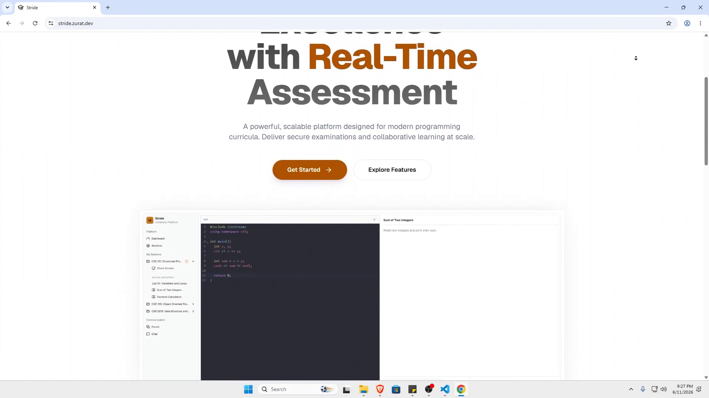
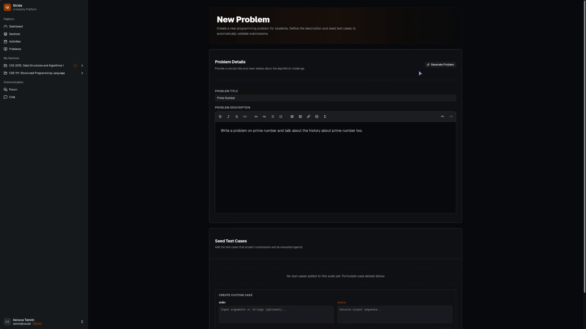

# Stride

A secure, cheat-resistant academic coding assessment platform designed to eliminate exam plagiarism in real-time. Stride replaces paper tests and messy local setups with advanced anti-cheating monitoring, AI-generated questions, built-in coding environments, and automated grading.

---

## Key Features

### Advanced Anti-Cheating Engine

Stride goes beyond basic monitoring to create a truly cheat-resistant examination environment:

- **Real-Time Proctoring Dashboard:** A centralized dashboard for administrators to monitor all students simultaneously.
- **AI-Powered Behavior Monitoring:**
  - **Plagiarism Detection:** Built-in code similarity analysis to flag copied solutions.
  - **Distraction Detection:** Advanced heuristics to detect off-screen activity, mouse movements, and keyboard patterns indicative of cheating.
  - **Anomaly Detection:** Real-time alerts for out-of-place code snippets, unusual timing patterns, or suspicious copy-pasting.
- **Proactive Intervention:** Automated actions to deter cheating:
  - **Visual Alerts:** Flashing red borders and warning pop-ups on the student's screen.
  - **Progress Freezing:** Halting submission timers or limiting typing access.
  - **Session Termination:** Automatic locking of the exam in cases of persistent violations.
- **Tamper-Evident Logging:** Comprehensive audit trail of all suspicious activities, timestamps, and system actions.

### AI-Assisted Question Generation

Accelerate your test creation process with intelligent automation:

- **One-Click Drafting:** Generate complete exam papers in seconds using simple text prompts.
- **Contextual Understanding:** The AI analyzes provided materials (e.g., course notes, textbook chapters) to generate relevant and context-specific questions.
- **Customizable Difficulty:** Easily specify the difficulty level, ranging from easy to expert, to match your assessment needs.
- **Built-in Problem Database:** Access a rich, pre-existing library of programming problems to draw from, ensuring variety and quality.

### Integrated Coding Environment

Eliminate the friction of local development setups:

- **In-Browser IDE:** A fully functional code editor embedded directly within the assessment interface.
- **Multi-Language Support:** Supports major programming languages including Python, Java, C++, and JavaScript.
- **Real-Time Feedback:** Instant compilation and execution of code directly within the browser.

### Automated Grading and Review

Streamline the assessment workflow:

- **Automated Test Suites:** Define custom test cases for each problem to validate correctness automatically.
- **AI-Powered Grading Assistance:** Leverage AI to help evaluate the quality of submissions, provide constructive feedback, and suggest improvements.
- **Detailed Analytics:** Generate comprehensive reports on student performance, time management, and problem-solving efficiency.

---

## Demos

### Full Demo

### AI-Assisted Problem Generation & Drafting

### Whitelabel Capabilities (Theme Customization)

Stride is fully whitelabeled and supports deep theme customization. Below is a comparison of two theme presets showing the dynamic adaptability of the system's styling.

  
  

---

## Technical Stack

- **Frontend:** [Svelte 5](https://svelte.dev/) (using Svelte Runes for reactive state management), [Vite](https://vite.dev/), [Tailwind CSS v4](https://tailwindcss.com/), and [Shadcn-Svelte](https://www.shadcn-svelte.com/) components.
- **Real-time Backend:** [Convex](https://convex.dev/) database & serverless backend functions.
- **Code Execution:** [Judge0](https://judge0.com/) API (compiles and runs student submissions against dynamic test suites).
- **AI Automation:** OpenAI models powered by [Vercel AI SDK](https://sdk.vercel.ai/) for automatic problem drafting and teacher grading assistance.
- **Rich Editor:** [Tiptap](https://tiptap.dev/) with math typesetting ([KaTeX](https://katex.org/)) and [CodeMirror](https://codemirror.net/) for the code IDE.
- **Localization:** [Paraglide JS](https://inlang.com/m/gerre34r/library-inlang-paraglideJs) via [Inlang](https://inlang.com/) for compile-time safe i18n.

---

## SDLC and Developer Experience (DX)

Stride includes several customized tools and strict validation suites to ensure a clean, maintainable, and type-safe codebase:

### Role-Based E2E Testing with Playwright

Our end-to-end suite ([docs/TESTING.md](./docs/TESTING.md)) splits automated test cases into three separate authenticated storage states:

- **Admin Flow:** Creating new student accounts and managing settings.
- **Teacher Flow:** Reviewing submissions, monitoring CCTV live streams, and viewing playback histories.
- **Student Flow:** Compiling and submitting Python code, using chat/forum features, and sharing screens.

### Git Flow and Branch Protection

To maintain main-branch stability, direct pushes to the `master` branch are strictly forbidden:

- **Pull Requests Only:** All development must occur on feature/fix branches. Changes can only be integrated into `master` via pull requests (PR).
- **Mandatory Peer Reviews:** Merging a PR requires a review and approval from at least one other team contributor.

### Git Hooks and Automated Commit Validation

We use Husky to run pre-commit and post-commit validations to ensure high code quality:

- **Commit Message Linting (`commit-msg`):** Enforces [Conventional Commits](./docs/commit-messages.md) formatting via `commitlint`. Commits with non-conforming messages are rejected automatically.
- **Code Pre-checks (`pre-commit`):**
  - Runs `lint-staged` to automatically format all modified files.
  - Triggers Svelte/TypeScript typechecking (`bun run check`) to ensure no broken or compilation-failing code can be committed.
- **Dead Code Detection:** We run `knip` to identify unused files, exports, and dependencies before integration.

---

## Getting Started

Detailed instructions for setup, running development servers, local Judge0 setups, and deployment can be found in our documentation folder:

- [Getting Started & Setup](./docs/getting-started.md)
- [End-to-End Testing Guide](./docs/TESTING.md)
- [Commit Message Guidelines](./docs/commit-messages.md)
- [Database Seeding Instructions](./docs/seeding.md)
- [Production Deployment Guide](./docs/deployment.md)
