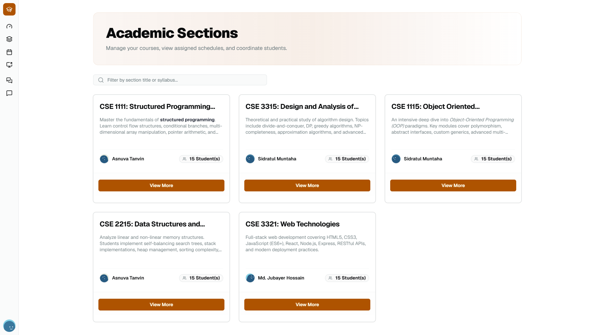
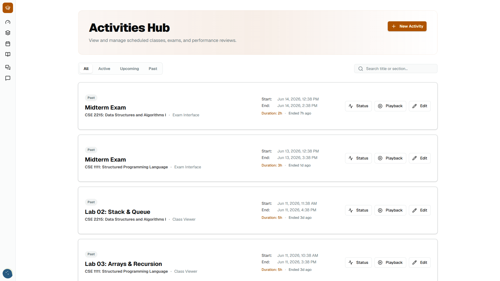
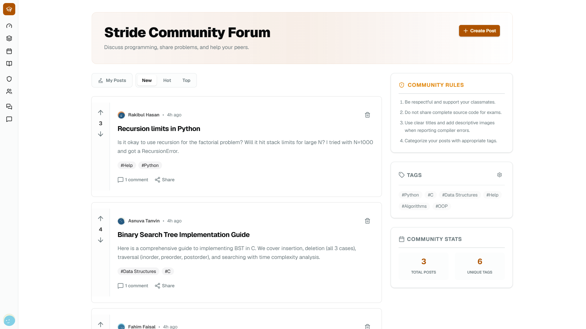

# Stride

**A real-time academic assessment and competitive programming platform.**

[](https://svelte.dev/)
[](https://convex.dev/)
[](https://bun.sh/)
[](https://opensource.org/licenses/MIT)

---

## Showcase

<div align="center">
  
  
  <br />
  
  
  
</div>

---

## Features

- **AI Problem Auto-Drafting:** Teachers can use OpenAI GPT models to instantly generate comprehensive programming problems, complete with edge-case test suites and HTML-formatted descriptions.
- **Rich Text and LaTeX Support:** An embedded Tiptap editor provides seamless markdown and KaTeX/LaTeX math support for writing complex mathematical problems.
- **Remote Code Execution:** Securely compile and execute student submissions against test cases using the Judge0 API.
- **Real-Time Sync:** Powered by Convex, submissions, problem updates, and assessments sync across all active clients instantaneously without manual refreshing.
- **Modern UI:** A sleek, responsive, and accessible interface built with Tailwind CSS v4 and Shadcn-Svelte.

---

## Tech Stack

### Frontend

- **Framework:** [Svelte 5](https://svelte-5-preview.vercel.app/) (using Runes for state management)
- **Styling:** [Tailwind CSS v4](https://tailwindcss.com/)
- **Components:** [Shadcn-Svelte](https://www.shadcn-svelte.com/)
- **Rich Text:** [Tiptap](https://tiptap.dev/) (with Math extension)

### Backend and Infrastructure

- **Database and Backend:** [Convex](https://convex.dev/) (Real-time backend-as-a-service)
- **Code Execution:** [Judge0](https://judge0.com/) API
- **AI Generation:** [Vercel AI SDK](https://sdk.vercel.ai/) and OpenAI API
- **Package Manager:** [Bun](https://bun.sh/)

---

## Getting Started

### Prerequisites

Ensure you have the following installed:

- **[Bun](https://bun.sh/)** (Required: npm/yarn are not used in this project)
- **Node.js** (v18 or higher recommended)

### Installation

1. **Clone the repository**

   ```bash
   git clone https://github.com/hamedzurat/stride.git
   cd stride
   ```

2. **Install dependencies using Bun**

   ```bash
   bun install
   ```

3. **Environment Variables**
   Create a `.env.local` file in the root directory and add the following keys. You will need active accounts for Convex, OpenAI, and Judge0.

   ```env
   # .env.local

   # Convex Configuration
   CONVEX_DEPLOYMENT=your_convex_deployment_name
   NEXT_PUBLIC_CONVEX_URL=https://your-convex-url.convex.cloud

   # OpenAI (For AI Problem Generator)
   OPENAI_API_KEY=sk-your_openai_api_key

   # Judge0 (For Remote Code Execution)
   JUDGE0_API_KEY=your_judge0_api_key
   ```

4. **Run the Development Server**
   Start the SvelteKit frontend and the Convex backend concurrently:
   ```bash
   bun run dev
   ```
   The app will be available at `http://localhost:5173`.

---

## Project Structure

```text
stride/
├── .agents/              # AI Agent Skills and Resources
├── convex/               # Convex Backend Functions and Schema
│   ├── _generated/       # Autogenerated Convex Types
│   ├── schema.ts         # Database Schema Definition
│   └── ...               # Backend Mutations and Queries
├── src/                  # SvelteKit Application
│   ├── lib/              # Shared Utilities, Components, and Hooks
│   │   ├── components/   # UI Components (Shadcn, Tiptap, etc.)
│   │   └── ...
│   ├── routes/           # File-based Routing (Pages and API Endpoints)
│   │   ├── (api)/        # Server-side API endpoints (e.g., AI generation)
│   │   └── (app)/        # Frontend application pages
│   └── app.html          # Base HTML template
├── static/               # Public Static Assets
├── package.json          # Project Dependencies (Bun)
└── README.md             # Project Documentation
```
